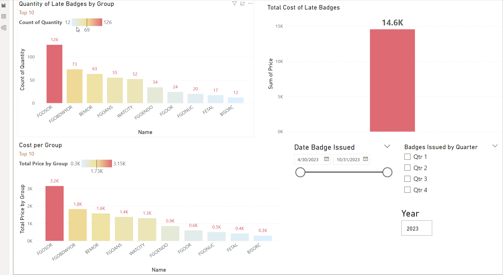

# PDF Data Extraction and Excel Appending Script

## Overview

This script is designed to extract data from PDF files containing invoice information and append the extracted data to an Excel file. It uses the pdfplumber library to read PDF files and the pandas library to manage data and write to Excel files.

## Requirements

    Python 3.x
    Libraries: pdfplumber, pandas, re, os
    An environment that can execute Python scripts.

## Installation

Before running the script, ensure that you have installed the required libraries using pip:

pip install pdfplumber pandas

## Usage

    1. Place all PDF files from which you want to extract data into a single directory.
    2. Update the folder_path variable in the script with the path to the directory containing your PDF files.
    3. Ensure that the Excel file you want to append data to exists and update the excel_path variable with the correct file path.
    4. Run the script in your Python environment.

## How It Works

    - The script iterates over each PDF file in the specified directory.
    - Using pdfplumber, it extracts text from each page of the PDF and checks for the string "Unreturned Dosimeters".
    - If the string is found, it applies a regular expression pattern to find matches of specific invoice data.
    - Each found match is added to a list of all records.
    - The list of all records is converted into a pandas DataFrame with appropriate column headers.
    - Finally, the script checks if the specified Excel file exists:
        - If it does, it appends the data to the existing file without adding header rows.
        - If it does not exist, it creates a new Excel file and writes the DataFrame with headers.

## Output

The script prints the first few rows and the shape of the DataFrame to verify the extraction. It then saves the data to the specified Excel file and prints a confirmation message.
Notes

    - Ensure that the Excel file you want to write to is not open in another program when you run the script.
    - The script assumes that the Excel file has a worksheet named 'Sheet1'.
    - If your Excel workbook has a different sheet name, update the writer.sheets['Sheet1'] reference to match your sheet name.
    - The script does not handle merged cells in the Excel file.

## Reports

Here is an exmple of a dashboard created in PowerBI from the extracted data. Here I was trying to determine what deparments had the highest instances of not turning in radiation dose badges and the costs associated.

## Disclaimer

This script is provided "as is", without warranty of any kind. Use it at your own risk.